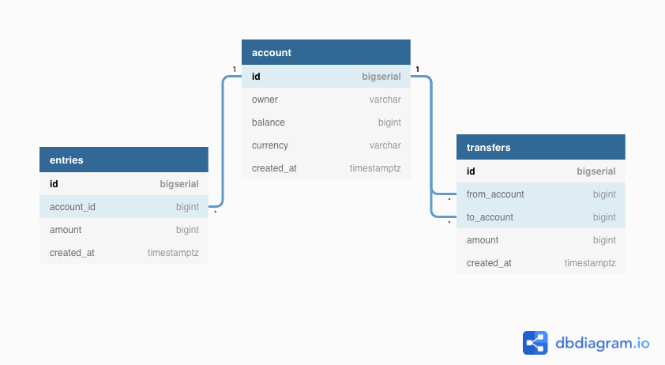

# BANCO - A crude bank backend API

## FUNCTIONALITY
- Create and manage user accounts
- Record changes to bank balance - entry in db for each change
- Money transaction - maintain consistency in a transaction

### REQUIREMENTS
- Go
- Docker
  - Postgres
- Make

#### INITIAL SETUP
- export all secret environment variables
```bash
make export-vars
```
#### DATABASE DESIGN & SETUP

- Bring up postgres docker container and create user and db for banco
```bash
make db-setup
```
- Create a new migration file (both up and down)
```bash
make MIGRATION_NAME=some_name cli-migrate
```
#### TODO
- split migration.sql to multiple migration scripts - done this with golang migrate cli tool, need to check how to do it with code
- move some db env variables to .env file

- add colors to make commands
- all scripts in one folder